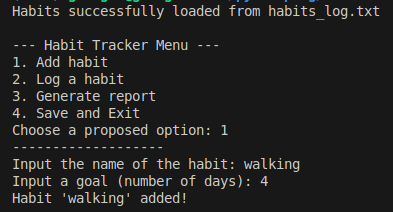
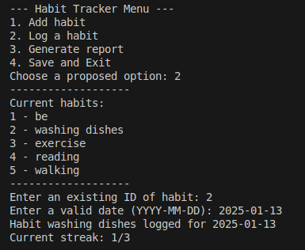
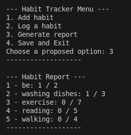

# Habit Tracker Project  
#### Video Demo: https://youtu.be/KYTIoWvmWyI 

## Description  

This project implements a **habit tracker**, allowing users to add habits, log their progress by date, and generate reports. The data structure chosen for habits is a list of dictionaries. Each dictionary represents a habit with the following attributes:  

- **id**: A unique identifier starting from `0` and incrementing automatically with each new habit.  
- **name**: The name of the habit.  
- **goal**: The user's goal for this habit (e.g., days of streak).  
- **log**: A list of dates on which the habit was completed.  

### Workflow Overview  

1. **Initialization**: Before the program starts, it checks for a pre-existing habits list stored in a text file. If the file exists, the program loads the habits. If not, it starts with an empty list.  
2. **User Interaction**: The program presents the user with four main options:  
   1. Add a habit  
   2. Log a habit  
   3. Generate a report  
   4. Save and exit  

Each option corresponds to a specific functionality described in detail below.  

---

## Features  

### 1. **Add a Habit**  
This feature allows users to create a new habit.  

- **How it works**:  
  - The user provides the habit's name and goal.  
  - The habit is initialized using the `add_habit` function and appended to the habits list.  

### 2. **Log a Habit**  
This feature enables users to log their progress for a habit on a specific date.  

- **Steps**:  
  1. The program displays a list of existing habits along with their `id`s.  
  2. The user inputs a valid habit `id`. If the input is invalid, the program will continue prompting until a valid `id` is entered.  
  3. The user inputs a date in the `YYYY-MM-DD` format.  
     - The `valid_date` function checks the date's format and ensures it is not in the future.  
     - If the date is already logged for the selected habit, it will not be added again.  
  4. Once logged, the program notifies the user of their current progress toward the goal.  

### 3. **Generate Report**  
This feature generates a report to help users visualize their progress.  

- **Output**:  
  - A list of all habits with their current progress ratio (`streak / goal`).  
  - The streak is calculated using the `calcul_streak` function, which processes the logged dates to determine the most recent streak.  

### 4. **Save and Exit**  
This feature allows users to save their data for future use and exit the program.  

- **Why it's important**:  
  Initially, saving data was overlooked, but repeated testing and the need to re-enter habits prompted the inclusion of this functionality. Now, the program writes the habits list to a file, ensuring all progress is preserved.  

---

## Installation and Usage  

1. Clone or download this repository.  
2. Ensure Python is installed on your system.  
3. Run the program using the command:  
   ```bash
   python habit_tracker.py
   ```  
4. Follow the on-screen instructions to add, log, generate reports, or save your progress.  

---

## Notes  

- The program uses a **text file** to save and reload data. Ensure the file conforms to the expected format for proper functionality.  
- Error handling is implemented to manage invalid inputs and ensure robustness.  

---

## Future Improvements  

1. Add support for habit categories or tags.  
2. Provide graphical visualizations for reports.  
3. Allow for habit deletion or modification.  
4. Include reminders or notifications for logging habits. 
5. Gamification: Implement a points system. You gain points for being on track and you can trade these for entertaining activities for yourself.
6. Different files saving format : text, csv, html
7. Improve user interface 

---
## Screenshots
<p align="center">
  
  
  
</p>


